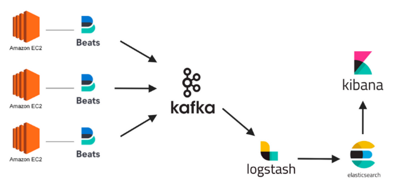

# Log Streaming System using ELK Stack and Apache Kafka



## Why Kafka with ELK Stack

### 1️⃣ Cơ chế Buffering & Backpressure Handling (Giảm tải cho Elasticsearch)
- Elasticsearch không chịu nổi khi ingest quá nhiều logs cùng lúc (bị quá tải).
- Kafka đóng vai trò như một buffer, giúp lưu trữ logs tạm thời, tránh Elasticsearch bị sập.
- Cơ chế này giúp Kafka scale ingestion logs, đảm bảo hệ thống không bị mất logs.

**Ví dụ:**
- Nếu Elasticsearch quá tải, Kafka tự động giữ logs trong topic cho đến khi có consumer xử lý.
- Sau khi ES hồi phục, Logstash tiếp tục đọc logs từ Kafka mà không bị mất dữ liệu.

---

### 2️⃣ Cơ chế Pub/Sub giúp Scale Consumer
- Kafka dùng cơ chế Pub/Sub (Publish-Subscribe) → giúp scale hệ thống logging dễ dàng.
- Nhiều loại logs khác nhau → Mỗi logs một topic riêng (syslog, app logs, k8s logs...).
- Logstash/Fluentd có thể chạy nhiều consumer song song, scale dễ dàng.

**📌 Lợi ích:**
✔ Kafka giúp tách biệt Producer (Beats) & Consumer (Logstash) → Hệ thống linh hoạt hơn.
✔ Elasticsearch không cần ingest trực tiếp → Dễ scale hệ thống logs hơn.

---

### 3️⃣ Cơ chế Retention & Replay Logs (Đảm bảo Logs không bị mất)
- Kafka có Retention Policy, cho phép lưu logs trong Kafka trong N ngày (vd: 7 ngày).

**📌 Lợi ích:**
✔ Nếu Elasticsearch sập, Kafka vẫn giữ logs → Không mất dữ liệu.
✔ Có thể replay logs để phân tích lại (reprocess logs) nếu cần debug.

**Ví dụ:**
```bash
kafka-console-consumer.sh --bootstrap-server kafka:9092 --topic syslogs_topic --from-beginning
```
📌 Lệnh trên giúp đọc lại toàn bộ logs đã lưu trong Kafka, cực kỳ hữu ích để debug.

---

## 🔥 Kết luận: Tại sao Kafka được dùng trong Logging với ELK?
✔ Buffering → Chống quá tải Elasticsearch.
✔ Pub/Sub → Dễ scale logging pipeline.
✔ Retention & Replay → Logs không bị mất.

🚀 **Nếu không có Kafka, khi Elasticsearch quá tải → logs có thể bị mất vĩnh viễn.**
👉 Kafka giúp ELK pipeline ổn định, linh hoạt và dễ scale hơn.

---

## Important Metrics

### 1️⃣ Cấu hình Topic và Partitioning
📌 **Mục tiêu:** Tăng throughput bằng cách chia nhỏ tải xử lý.

- **Num Partitions (num.partitions):**
  - Mặc định: 1 → Không đủ, phải tăng lên.
  - Khuyến nghị: Partitions = Throughput cần xử lý / Throughput mỗi partition.
  - Với 1.6K logs/s, nếu mỗi partition xử lý 300 logs/s → cần ít nhất 6-8 partitions.

- **Replication Factor (replication.factor):**
  - Khuyến nghị: 3 (đảm bảo độ bền dữ liệu, chống mất logs).

- **Min In-Sync Replicas (min.insync.replicas):**
  - Giá trị hợp lý: 2 (đảm bảo có ít nhất 2 replica lưu logs trước khi Kafka xác nhận).

---

### 2️⃣ Producer Configuration (Beats, Fluentd, Logstash...)
📌 **Mục tiêu:** Tối ưu tốc độ gửi logs vào Kafka.

- **Batch Size (batch.size):**
  - Mặc định khá nhỏ (16KB), có thể tăng lên 128KB - 512KB để giảm số lần gửi.

- **Linger.ms (linger.ms):**
  - Mặc định là 0ms (gửi ngay khi có dữ liệu).
  - Tăng lên ~10-50ms để nhóm nhiều logs lại trước khi gửi, giảm tải network.

- **Compression (compression.type):**
  - Snappy hoặc LZ4 giúp giảm băng thông, nhưng vẫn giữ được hiệu suất cao.
  - Gzip nén tốt hơn nhưng CPU nặng hơn (chỉ dùng nếu muốn tiết kiệm dung lượng).

---

### 3️⃣ Broker Configuration
📌 **Mục tiêu:** Đảm bảo Kafka chịu tải tốt và tránh mất logs.

- **Log Segment Size (log.segment.bytes):**
  - Mặc định: 1GB, có thể giảm xuống 500MB để Kafka flush logs nhanh hơn.

- **Log Retention (log.retention.hours):**
  - Tùy hệ thống, thường đặt 24-72 giờ, nếu cần giữ logs lâu hơn thì tăng lên.

- **Log Cleanup Policy (log.cleanup.policy):**
  - `Delete` (mặc định, xóa logs khi hết retention time).
  - `Compact` nếu muốn giữ logs lâu hơn theo key.

---

### 4️⃣ Consumer Configuration (Logstash/Fluentd đọc logs từ Kafka)
📌 **Mục tiêu:** Đọc logs nhanh, không bị backlog.

- **Max Poll Records (max.poll.records):**
  - Mặc định: 500, có thể tăng lên 5.000 - 10.000 để đọc nhiều logs hơn mỗi lần.

- **Fetch Min Bytes (fetch.min.bytes):**
  - Giảm xuống ~1KB để consumer đọc logs ngay khi có dữ liệu, tránh delay.

- **Auto Commit (enable.auto.commit):**
  - Nên tắt (`false`), dùng manual commit để tránh mất logs khi consumer crash.

---

### 5️⃣ OS & Hardware Optimization
📌 **Mục tiêu:** Tránh nghẽn hiệu suất ở mức hệ thống.

- **Storage (Disk I/O):**
  - Dùng SSD/NVMe, Kafka phụ thuộc rất nhiều vào tốc độ ghi disk.
  - XFS hoặc EXT4 (KHÔNG dùng NTFS/ZFS).

- **Memory & Page Cache:**
  - Kafka dùng page cache của OS, nên RAM nhiều sẽ giúp Kafka nhanh hơn.
  - 16GB - 32GB RAM nếu Kafka chịu tải lớn.

- **Network:**
  - Kafka cần băng thông tốt, nên chạy trên 10Gbps network nếu có thể.

---

## 🔥 Kết luận: Những thông số quan trọng nhất
📌 Nếu hệ thống chịu tải **1M logs trong 10p (~1.6K logs/s)**, thì:
✔ **Partitions:** Ít nhất 6-8 partitions cho mỗi topic.
✔ **Replication Factor:** Ít nhất 3 để tránh mất logs.
✔ **Batch Size:** Tăng lên 128KB - 512KB để giảm số lần gửi.
✔ **Linger.ms:** Đặt 10-50ms để tối ưu throughput.
✔ **Compression:** Dùng Snappy hoặc LZ4 để giảm tải network.
✔ **Consumer max.poll.records:** Tăng lên 5.000 - 10.000 để đọc logs nhanh.
✔ **Disk:** Dùng SSD/NVMe + ít nhất 16GB RAM.